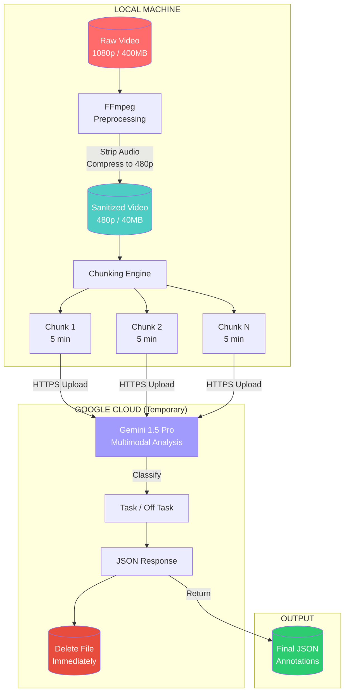
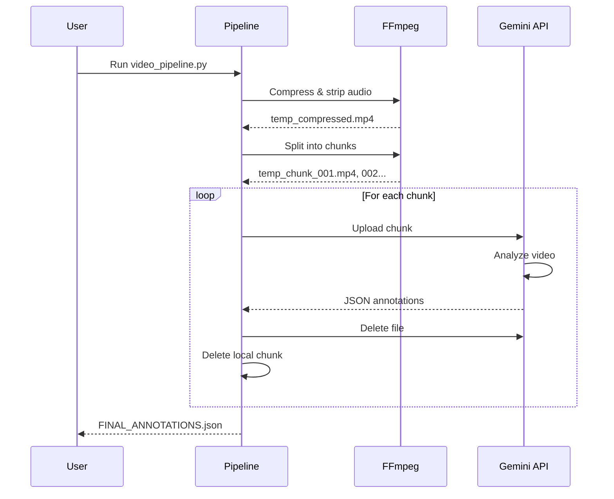
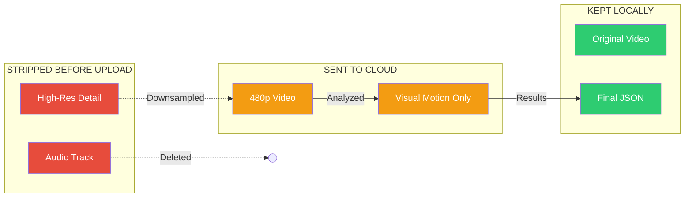

# FocusAnnotate Architecture

```mermaid
flowchart TB
    subgraph LOCAL["LOCAL MACHINE"]
        A[("Raw Video<br/>1080p / 400MB")] --> B["FFmpeg<br/>Preprocessing"]
        B --> |"Strip Audio<br/>Compress to 480p"| C[("Sanitized Video<br/>480p / 40MB")]
        C --> D["Chunking Engine"]
        D --> E1["Chunk 1<br/>5 min"]
        D --> E2["Chunk 2<br/>5 min"]
        D --> E3["Chunk N<br/>5 min"]
    end

    subgraph CLOUD["GOOGLE CLOUD (Temporary)"]
        F["Gemini 1.5 Pro<br/>Multimodal Analysis"]
        F --> |"Classify"| G["Task / Off Task"]
        G --> H["JSON Response"]
        H --> I[("Delete File<br/>Immediately")]
    end

    subgraph OUTPUT["OUTPUT"]
        J[("Final JSON<br/>Annotations")]
    end

    E1 --> |"HTTPS Upload"| F
    E2 --> |"HTTPS Upload"| F
    E3 --> |"HTTPS Upload"| F
    H --> |"Return"| J

    style A fill:#ff6b6b,color:#fff
    style C fill:#4ecdc4,color:#fff
    style F fill:#a29bfe,color:#fff
    style J fill:#2ecc71,color:#fff
    style I fill:#e74c3c,color:#fff
```

## Pipeline Stages

```mermaid
sequenceDiagram
    participant U as User
    participant P as Pipeline
    participant FF as FFmpeg
    participant G as Gemini API

    U->>P: Run video_pipeline.py
    P->>FF: Compress & strip audio
    FF-->>P: temp_compressed.mp4
    P->>FF: Split into chunks
    FF-->>P: temp_chunk_001.mp4, 002...

    loop For each chunk
        P->>G: Upload chunk
        G->>G: Analyze video
        G-->>P: JSON annotations
        P->>G: Delete file
        P->>P: Delete local chunk
    end

    P-->>U: FINAL_ANNOTATIONS.json
```

## Data Flow

```mermaid
graph LR
    A[Raw Video] -->|Local| B[Audio Removed]
    B -->|Local| C[480p Compressed]
    C -->|Local| D[5-min Chunks]
    D -->|HTTPS| E[Gemini API]
    E -->|HTTPS| F[JSON Response]
    F -->|Local| G[Merged Output]

    style A fill:#e74c3c
    style B fill:#f39c12
    style C fill:#f39c12
    style D fill:#3498db
    style E fill:#9b59b6
    style F fill:#3498db
    style G fill:#2ecc71
```

## Privacy Layer

```mermaid
flowchart LR
    subgraph REMOVED["STRIPPED BEFORE UPLOAD"]
        A1[Audio Track]
        A2[High-Res Detail]
    end

    subgraph TRANSMITTED["SENT TO CLOUD"]
        B1[480p Video]
        B2[Visual Motion Only]
    end

    subgraph RETAINED["KEPT LOCALLY"]
        C1[Original Video]
        C2[Final JSON]
    end

    A1 -.->|Deleted| X1((" "))
    A2 -.->|Downsampled| B1
    B1 -->|Analyzed| B2
    B2 -->|Results| C2

    style A1 fill:#e74c3c,color:#fff
    style A2 fill:#e74c3c,color:#fff
    style B1 fill:#f39c12,color:#fff
    style B2 fill:#f39c12,color:#fff
    style C1 fill:#2ecc71,color:#fff
    style C2 fill:#2ecc71,color:#fff
```
